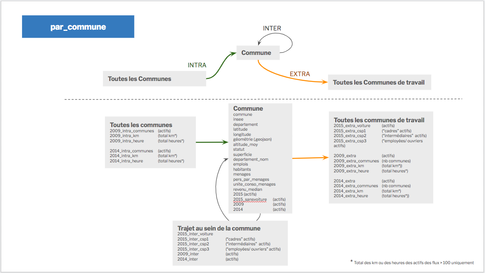

# Hackaviz2019
Les fichiers de données de l'hackaviz2019 organisé par [Toulouse Dataviz](https://toulouse-dataviz.fr).

## Mode d'emploi

## Ceux qui restent, sortent ou rentrent

## Un fichier avec une ligne par commune

## Un fichier avec une ligne par trajet

## Compléments et références

Les fichiers xlsx contiennent le détail de la signification de chaque champs.

[Les conditions du concours](http://toulouse-dataviz.fr/hackaviz-2019-2)

